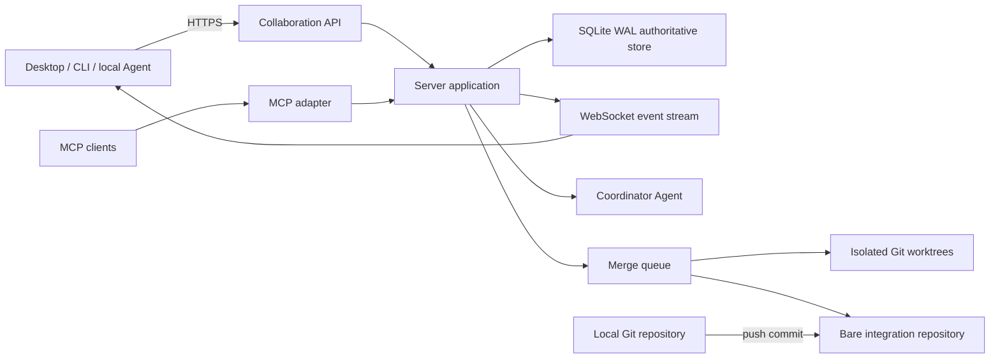

# RFC: LAN Multi-User Collaboration and Server-Coordinated Delivery

| Field | Value |
|-------|-------|
| **Status** | In Review |
| **Decision type** | Reversible (two-way door) |
| **Author(s)** | PlanWeave maintainers |
| **Created** | 2026-07-12 |
| **Last Updated** | 2026-07-12 |

## Summary

Add a modular `packages/server` process as the authoritative coordinator for LAN collaboration while preserving the current file-backed single-user mode. The server owns identity, project discussions, immutable proposal revisions, approvals, task assignments and leases, submissions, review state, audit events, and a serialized Git merge queue. `packages/runtime` remains the domain engine; `packages/mcp` becomes an Agent-facing adapter to the server in remote mode; Desktop and CLI gain remote connection profiles. Developers continue editing in local Git worktrees and submit commits rather than synchronized working-directory files.

## Goals and Non-Goals

### Goals

1. Atomically coordinate task claims and submissions for multiple LAN users without duplicate claims or lost updates.
2. Let each member independently contribute messages and attachments while a coordinator Agent maintains evidence-linked project artifacts.
3. Require revision-bound approval from configured approvers before execution begins.
4. Generate assignable PlanWeave work with explicit dependencies, ownership scopes, parallel locks, reviewers, and acceptance checks.
5. Preserve normal local coding and Git workflows, with server-side deterministic validation, review, and serialized merging.
6. Preserve the existing local-only CLI/Desktop workflow and its file formats during migration.
7. Make all consequential actions attributable, idempotent, recoverable after restart, and observable to connected clients.

### Non-Goals

- Real-time collaborative editing of source files or arbitrary Markdown using CRDTs.
- Internet-scale multi-region hosting, Kubernetes, or independently deployed microservices.
- Replacing Git hosting, IDEs, local coding Agents, or the existing executor integrations.
- Fully autonomous merging of security-sensitive or ownership-boundary-breaking changes.
- PostgreSQL support in the first implementation slice.
- Storing raw Git repository contents in the collaboration database.

## Motivation

PlanWeave already models task/block status, review feedback, dependency readiness, parallel safety, and logical locks. However, runtime state is a whole-file `RuntimeState` structure (`packages/runtime/src/types/state.ts:35-41`) loaded from and written back to `state.json` (`packages/runtime/src/state.ts:27-37`). Atomic rename prevents partial files (`packages/runtime/src/json.ts:9-22`) but does not make the read-check-write sequence in task claiming transactional (`packages/runtime/src/taskManager/claimScheduler.ts:28-99`). Two server requests can therefore observe the same ready task before either write becomes visible.

The MCP process can listen on a LAN address and correctly requires token or OAuth protection outside loopback (`packages/mcp/src/config.ts:99-108`), but it constructs a fresh, sessionless MCP transport for each request (`packages/mcp/src/server.ts:81-93`). It exposes tools over POST, not membership, durable discussions, proposal approval, attachment, presence, or event-stream semantics.

Desktop currently reaches runtime functions through local Electron IPC (`packages/desktop/src/main/runtimeBridgeHandlerRegistry.ts:306-380`) and observes runtime changes through native file watching or polling (`packages/desktop/src/main/runtimeStateWatch.ts:37-41`, `packages/desktop/src/main/runtimeStateWatch.ts:182-203`). This is a local projection mechanism, not a remote collaboration protocol.

Without a server authority boundary, opening the current state files to several machines would risk duplicate ownership, overwritten state, ambiguous approvals, and unreviewable merges. The affected users are small colocated teams that need to brainstorm together, agree on a plan, work independently, and integrate through one controlled path.

## Guide-Level Explanation

A maintainer starts one PlanWeave Server for a project and creates invitation codes. Each member joins with a named device identity. A project begins in `draft`; members post independent messages and attachments into a planning room. The coordinator Agent processes new evidence incrementally and maintains structured artifacts such as the brief, requirements, constraints, decisions, open questions, and risk register. Every generated claim links back to message or attachment identifiers.

When ready, the coordinator creates an immutable proposal revision. Required approvers respond with `approve`, `request_changes`, or `abstain`. Approval applies only to the exact revision hash; changing the proposal creates a new revision and invalidates previous approvals. A transition to `executing` is allowed only when the configured approval policy passes.

The coordinator then creates PlanWeave tasks with assignees or required skills, ownership scopes, base Git revision, dependencies, parallel locks, reviewers, and acceptance commands. A member claims work through Desktop or CLI. The server creates the assignment atomically and issues a renewable lease. Local checkout creates a normal Git branch. The member codes with any editor or Agent, commits, pushes the branch, and submits its head commit.

The merge queue validates identity, ancestry, ownership scopes, and evidence; prepares an isolated worktree on the latest target; runs targeted checks; performs structured Agent and/or human review; then runs the repository merge gate and updates the target branch serially. Failures produce structured feedback without deleting the contributor's branch.

Local-only users continue using existing commands and file-backed state. Remote collaboration is opt-in through a server connection profile.

## Reference-Level Explanation

### Architecture and authority



Only the server writes collaborative state. SQLite runs in WAL mode and all state-changing use cases execute in explicit transactions. Every aggregate has a monotonically increasing version; stale commands fail with a conflict response. Every client command has an idempotency key, and every accepted command appends an audit/domain event in the same transaction.

Runtime domain logic must not import the server or persistence implementation. The first slice adds narrow repository or unit-of-work ports at the mutation boundary while retaining a `FileRuntimeRepository`. Server mode uses a `SqliteRuntimeRepository`. The current `state.json` may be emitted as a compatibility projection but is never the server source of truth.

### Server modules

`packages/server` is one deployable process with internal modules:

- `identity`: users, devices, invitations, revocable sessions, roles.
- `planning`: rooms, messages, attachment metadata, artifact citations.
- `proposals`: immutable revisions, approval policy, votes, lifecycle transitions.
- `work`: tasks, assignments, leases, heartbeat, submission state.
- `events`: durable event sequence plus WebSocket notification and resync.
- `agents`: coordinator runs, inputs, outputs, budgets, cancellation and retry.
- `git`: bare repository, worktree lifecycle, ownership validation and merge queue.
- `audit`: attribution and append-only action history.

These are modules, not separately deployed services. Cross-module changes share one database transaction where required.

### Data model

The initial schema contains `users`, `devices`, `projects`, `memberships`, `rooms`, `messages`, `attachments`, `artifacts`, `artifact_sources`, `proposal_revisions`, `approvals`, `tasks`, `task_dependencies`, `assignments`, `leases`, `submissions`, `reviews`, `merge_queue_entries`, `agent_runs`, `domain_events`, `audit_log`, and `idempotency_keys`.

Attachments use content-addressed files below the server data directory. The database stores hashes, sizes, media types, original names, uploader, and scan status. Uploads use a staged file followed by validated atomic promotion; project authorization is checked on every read.

### State machines

Project planning:

```text
draft -> reviewing -> approved -> executing -> completed
            |             |
            v             v
     changes_requested   draft (explicit reopen)
```

Assignment:

```text
available -> leased -> submitted -> reviewing -> accepted
                 |          |            |
                 v          v            v
              expired    withdrawn   needs_changes
```

Merge queue:

```text
queued -> preparing -> validating -> reviewing -> merge_ready -> merging -> merged
                            |            |              |
                            +----------> failed <-------+
```

### Network contracts

- `/api/v1/*`: versioned Desktop/CLI collaboration API.
- `/events`: authenticated WebSocket carrying versioned event envelopes.
- `/mcp`: Agent tools; remote tools call server application services.
- `/blobs/*`: authenticated staged uploads and downloads.
- `/healthz` and `/readyz`: liveness and dependency readiness.

WebSocket events are invalidation notifications, not the sole data source. Each contains `eventId`, `projectId`, `aggregateType`, `aggregateId`, `aggregateVersion`, `type`, and `occurredAt`. On gaps or reconnect, a client requests a snapshot or events after its last durable event ID.

### Task allocation contract

Collaboration metadata is stored outside the Plan Package initially to preserve package compatibility. A server task binding references the stable PlanWeave task/block ID and adds:

```ts
type WorkAssignmentPolicy = {
  requiredSkills: string[];
  ownershipScopes: string[];
  baseRevision: string;
  branchName: string;
  reviewers: string[];
  acceptanceChecks: string[];
  leaseDurationSeconds: number;
};
```

Existing parallel safety and lock conflict semantics remain authoritative: implementation dispatch rejects non-parallel-safe blocks (`packages/runtime/src/taskManager/claimBlockDispatch.ts:23-40`), while conflict evaluation accounts for dependency reachability and overlapping logical locks (`packages/runtime/src/taskManager/selectors.ts:161-189`).

### Merge policy

The server never merges an unpushed working directory. A submission identifies immutable `baseCommit` and `headCommit`. Validation checks membership, assignment, commit reachability, changed paths, ownership policy, repository cleanliness, and required evidence. Each candidate is tested in a disposable worktree. Candidate preparation may run concurrently; target-branch mutation is serialized. A final head check prevents merging a result validated against an obsolete target.

Repository-level required checks follow the current CI chain: lint, build, then tests (`package.json:8-13`, `package.json:33`). Targeted package checks run earlier for feedback speed, but do not replace the final merge gate.

### Compatibility and rollback

Remote mode is additive. Existing public runtime functions and local workspace files remain supported. A feature flag/connection profile selects local or remote mode. Rollback disables remote project mutation, drains or freezes the merge queue, exports audit/snapshot data, and returns clients to local-only operation; Git commits and branches remain intact.

## Drawbacks

- A new server and database introduce schema migration, backup, authentication, and operational responsibilities.
- Repository ports touch many runtime mutations and can create an oversized abstraction if introduced wholesale.
- Coordinator artifacts can become misleading unless citations and revision boundaries are enforced.
- Git worktrees and platform-specific command behavior add Windows/macOS/Linux test burden.
- SQLite remains a single-writer system; it is appropriate for the initial LAN deployment but not unlimited horizontal scaling.
- Dual local/remote modes increase contract and testing surface.

### Pre-mortem — how this fails

| Failure | Trigger | Mitigation in design |
|---|---|---|
| Duplicate task ownership | Claim check and write are separate | Transactional conditional claim plus unique active-assignment constraint |
| Clients display stale state | WebSocket loss or reconnect | Durable event IDs, aggregate versions, gap detection, snapshot resync |
| Approval applies to changed plan | Mutable proposal body | Immutable proposal revision hash; approval keyed to revision |
| Coordinator invents consensus | Uncited synthesis | Artifact-source join table; UI exposes sources; approval remains human action |
| Merge corrupts target flow | Concurrent target mutation | Parallel preparation but serialized merge with final target-head check |
| Server crash strands work | Lease or merge in intermediate state | Expiring leases and restart reconciliation for queue states |
| Runtime refactor destabilizes local mode | Big-bang persistence replacement | Mutation-by-mutation ports, parity tests, local mode kept as default |
| Sensitive file is exposed | Weak attachment/path validation | Content addressing, size/type policy, staged promotion, authorization, audit |

## Rationale and Alternatives

### Why This Design?

The repository already has reusable graph and execution semantics, so replacing runtime would discard tested behavior. The missing capability is a serialization and collaboration boundary. A modular monolith gives one transaction boundary for claims, approvals, audit, and event append while avoiding distributed-system failure modes. SQLite is already present in runtime as a derived PlanGraph index, so the toolchain has a local database precedent, while a separate authoritative schema avoids confusing rebuildable index data with durable collaboration data.

Git is the correct merge substrate because the desired workflow explicitly keeps local coding and normal merge semantics. CRDT synchronization would duplicate version control and would not supply builds, review evidence, or an auditable target history.

### Alternatives Considered

#### Alternative A: Expose the current MCP server and shared workspace

- **Pros:** Smallest initial change; existing auth and tools are reusable.
- **Cons:** No transactional task ownership, membership, durable event stream, proposal revisions, or merge queue. Whole-file state updates can overwrite concurrent decisions.
- **Why not chosen:** It cannot meet Goals 1, 3, 5, or 7 safely.

#### Alternative B: Build collaboration directly into the Electron main process

- **Pros:** Reuses the current IPC bridge and watcher infrastructure.
- **Cons:** Couples server uptime to a user desktop session, complicates headless deployment, and preserves local path assumptions throughout the protocol.
- **Why not chosen:** The coordinator and merge authority require a stable, headless owner independent of any participant UI.

#### Alternative C: Start with PostgreSQL, Redis, queue workers, and separate services

- **Pros:** Easier horizontal scaling and independent worker deployment later.
- **Cons:** Larger operational footprint, distributed transactions, more failure modes, and slower iteration for a LAN team.
- **Why not chosen:** It solves scale not demonstrated by the target use case. Module boundaries and repository interfaces preserve a later migration route.

#### Alternative D: Do nothing and coordinate only through Git and chat

- **Pros:** No engineering or operations cost.
- **Cons:** Planning evidence, consensus, task graph, Agent context, assignment boundaries, and review feedback remain fragmented and manual.
- **Why not chosen:** It does not deliver the requested product workflow.

### Comparison Matrix

| Dimension | Proposed modular server | Shared MCP/workspace | Electron-hosted | Distributed services |
|-----------|-------------------------|----------------------|-----------------|----------------------|
| Codebase alignment | High | Superficially high | Medium | Medium |
| Concurrency safety | High | Low | Medium | High |
| Operational burden | Low-medium | Low | Medium | High |
| Headless reliability | High | Medium | Low | High |
| Migration effort | Medium | Low | Medium | High |
| Future scalability | Medium-high | Low | Low-medium | High |
| Reversibility | High | High | Medium | Medium |

### Trade-off Summary

The proposal accepts one new deployable and a durable database in exchange for clear ownership, transactional behavior, restart recovery, and auditable delivery. It deliberately gives up immediate horizontal scale and real-time document co-editing.

### What If We Do Nothing?

PlanWeave remains a capable single-user orchestrator, but team coordination stays external and the server cannot safely decide who owns work or merge concurrent results. LAN exposure alone would create correctness risk rather than collaboration.

## Prior Art

The decision uses established local patterns rather than an external product dependency: PlanWeave's runtime graph supplies dependency and lock semantics; its SQLite PlanGraph layer demonstrates a local derived database; MCP supplies Agent tool transport; Git supplies immutable code submissions. External protocol/library selection is intentionally deferred to implementation spikes so package versions can be evaluated against the repository's Node 22.5+, ESM, Electron, and packaging constraints.

## Unresolved Questions

### Before acceptance

- [ ] Name the human owner/approver for server schema and security-sensitive API changes.
- [ ] Confirm whether the first supported topology is one server project per Git repository or one server hosting multiple repositories.

### During implementation

- [ ] Select the SQLite driver and migration tool after an install/build/package compatibility spike.
- [ ] Select WebSocket and HTTP routing implementation after checking reuse versus isolation from the MCP HTTP server.
- [ ] Define the first coordinator Agent provider and budget/cancellation policy.

### Out of scope

- [ ] Define the measured trigger for PostgreSQL migration after real usage telemetry exists.

## Future Possibilities

- PostgreSQL repository implementation and independently scaled validation workers.
- Remote access through WireGuard/Tailscale and organization SSO.
- Federated Git hosting adapters for GitHub/GitLab/Forgejo pull requests.
- Optional CRDT editing for planning documents only, without synchronizing source trees.

